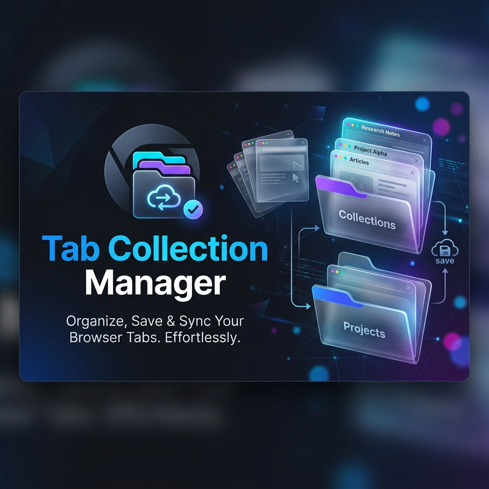

# 🗂️ Tab Collection Manager

**Tab Collection Manager** is a premium Chrome extension designed to help you organize, save, and restore your browsing sessions with ease. featuring a sleek dark mode UI and powerful state management, it ensures you never lose a tab again.

---

## ✨ Features

- **🚀 Instant Sessions**: Save your current browser session with a single click.
- **📁 Custom Collections**: Organize tabs into named folders for different projects or interests.
- **🔄 Auto-Save**: Automatically track and update your current session in the background.
- **💾 Backup & Restore**: Robust backup system to recover sessions after accidental closures.
- **🌓 Premium UI**: A modern, glassmorphic dark mode interface built for productivity.
- **🖱️ Manual Management**: Add tabs manually, rename collections, and reorder items effortlessly.
- **🌐 Cross-Browser**: Fully compatible with Chrome, Brave, Edge, and Firefox (Manifest V3).

---

## 🛠️ Installation

### Developer Mode (Recommended)

1.  **Download/Clone** this repository to your local machine.
2.  Open your browser and navigate to the extensions page:
    - Chrome: `chrome://extensions/`
    - Brave: `brave://extensions/`
    - Edge: `edge://extensions/`
3.  Enable **Developer mode** (usually a toggle in the top-right corner).
4.  Click on **Load unpacked** and select the root directory of this project (`Tab-Collection-Manager`).
5.  The Tab Collection Manager icon should now appear in your extension toolbar!

---

## 📖 How to Use

### 1. Saving Tabs
Click the extension icon to open the popup. Enter a name in the "New Collection" field and hit Enter to create a folder. You can then add your currently open tabs to it.

### 2. Auto-Save
Toggle the "Auto-Save" switch in the settings to have the extension automatically keep track of your active windows in the "Current Session" collection.

### 3. Restoring Sessions
Click the **Restore** button on any collection to open all its tabs in the background.

### 4. Backups
If you ever lose your data, check the "Backup" section at the bottom of the popup to restore from the last known state.

---

## 🏗️ Technical Details

- **Architecture**: Manifest V3 Service Worker (`background.js`).
- **Storage**: Uses `chrome.storage.local` with a serialized update queue to prevent race conditions.
- **Styling**: Vanilla CSS with modern variables and glassmorphism effects.
- **Compatibility**: Cross-browser API wrapper (`chrome` / `browser`).

---

## 🔒 Permissions

The extension requires the following permissions to function:
- `tabs`: To read information about open tabs (title, URL) for saving.
- `storage`: To persist your collections and settings locally on your device.

---

## 📄 License

This project is open-source. Feel free to modify and use it as you see fit.

---

*Built with ❤️ for better tab management.*
