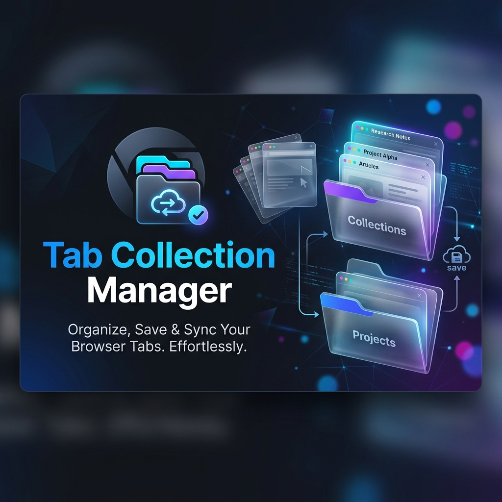

# 🗂️ Tab Collection Manager



**Tab Collection Manager** is a premium, high-performance browser extension designed to help you organize, save, and restore your browsing sessions with absolute state integrity. Featuring a sleek, glassmorphic dark mode interface and a robust background state architecture, it ensures your workspaces stay lightweight, secure, and permanent.

---

## ✨ Features

- **🚀 Instant Sessions**: Save your entire multi-window browser session with a single click or dynamic multi-select mode.
- **📁 Custom Spaces**: Organize tabs into named collections with unique metadata tracking (creation time, modified time, and drag-and-drop custom order).
- **🔄 Auto-Save Engine**: Background service worker automatically tracks window changes, tab closures, and URL shifts inside a dedicated, debounced (500ms) **Current Session** collection.
- **⚡ RAM Saver Mode**: Restores collections gracefully by leveraging background tab discarding (`api.tabs.discard`), preventing performance stutter or memory spikes.
- **📌 Pinned Workspaces & Tabs**: Keep critical collections locked at the top of your layout and enforce maximum pinned tab thresholds within individual folders.
- **🗂️ Side Panel Integration**: Full integration with the modern Chrome `sidePanel` API, allowing your workspace manager to persist comfortably alongside your active browsing.
- **🔍 Intelligent Sorting**: Sort both your root collection view and individual tab entries dynamically (e.g., custom drag-order, alphabetical, creation dates, or tab volume counts).
- **💾 Fail-Safe Backups**: Features a localized structural backup array to instantly recover from inadvertent system crashes or corruption events.

---

## 🛠️ Installation

### Developer Mode (Recommended)

1. **Download/Clone** this repository to your local computer.
2. Open your web browser and navigate to its extension management page:
   - **Chrome**: `chrome://extensions/`
   - **Brave**: `brave://extensions/`
   - **Edge**: `edge://extensions/`
3. Toggle on **Developer mode** in the top-right corner.
4. Build the extension (`npm install && npm run build`, see [Development](#-development)) and click
   **Load unpacked**, selecting the generated **`dist/`** folder. `dist/` is the only loadable
   build: the side panel's state layer lives in the bundled React store.
5. Pin the **Tab Collection Manager** icon directly to your browser's extension toolbar.

---

## 🧰 Development

Requires **Node.js 18+**. The extension is written in **JavaScript** (no TypeScript) and follows
[`skill.md`](./skill.md).

```bash
npm install        # install dev tooling (lint, format, tests)
npm run build      # build dist/ — load THIS folder unpacked
npm run dev        # dev browser: streams worker/panel errors, rebuilds + reloads on change
npm run lint       # ESLint
npm run format     # Prettier
npm test           # unit tests (Vitest)
```

**Build output:** `npm run build` writes `dist/`, the only loadable build. It bundles the React
side of the UI and composes `dist/sidepanel.html` from `popup.html`:

| You load | You get |
| --- | --- |
| `dist/` (after `npm run build`) | The whole side panel — React-rendered collections, tabs and every dialog (settings, add tabs, history, session details, duplicates, shortcuts help), plus the legacy controls bar and worker-backed features |
| the repository root | Not supported: the sources are uncompiled, and `popup.js` reads state through the bundled store, which only `dist/` provides |

Since Phase 3 the store in `src/store/` owns the state layer: one serialized write queue over the
`chrome.storage.local` contract, shared by both halves of the UI, so a legacy panel action and a
React list action can no longer lose each other's write. See
[`react-migration-plan.md`](./react-migration-plan.md) §8 and
[`docs/decisions/ADR-0004-single-write-queue.md`](./docs/decisions/ADR-0004-single-write-queue.md).

### Dev browser helper

`npm run dev` launches a Chromium browser (Chrome → Brave → Edge, whichever is installed) with
a **throwaway profile** and `dist/` loaded unpacked, then:

- streams the **background service worker's console output and exceptions** as `[sw ·]`, `[sw ▲]`,
  `[sw ✖]` — including crashes that happen during startup, with the source file and line;
- streams the **side panel's** own errors as `[panel …]`;
- **rebuilds and reloads** the extension whenever a source file changes.

```bash
npm run dev                # launch + watch
npm run dev -- --attach    # attach to a browser already started with --remote-debugging-port
npm run dev -- --smoke     # self-test: launch, check the worker is reachable, exit
npm run dev -- --which     # print the detected browser path
```

Notes: the browser runs on a separate profile (`%TEMP%/tcm-dev-profile`), so your normal
browsing profile and its extensions are untouched. After a reload, refresh the side panel tab
the helper opens (or reopen the side panel) to see UI changes — extension pages are not
hot-reloaded.

See [`react-migration-plan.md`](./react-migration-plan.md) for the migration roadmap and
[`skill.md`](./skill.md) for coding, folder, and versioning standards.

---

## 📖 How to Use

### 1. Organizing Your Layout
Click the extension action item or trigger the side panel. Enter a unique title into the folder console to initialize an empty collection folder (duplicate names are flagged case-insensitively).

### 2. Live Automation
Head into settings to toggle the background **Auto-Save Engine**. The background engine monitors system layout changes, applying specialized startup stabilization boundaries to isolate active workspaces perfectly.

### 3. Smart Workspace Restoration
Click **Restore** on any folder block to project tabs into your target active window. If **RAM Saver Mode** is running, restored background pages will remain dormant/discarded until you explicitly select them.

### 4. Custom Drag-and-Drop
Rearrange tab hierarchies by simply dragging a tab node by its handle. You can move items within a collection or seamlessly shift tabs across separate collections. Dropping elements automatically switches the target environment's sequence filter to `custom`.

---

## 🏗️ Technical Details

- **Architecture**: Chrome Manifest V3 API using a centralized Service Worker (`background.js`) alongside responsive UI instances (`popup.js`).
- **State Management**: Implements a strict asynchronous serialization queue (`updateQueue = updateQueue.then(...)`) to execute deep-cloned state adjustments sequentially, eliminating data corruption from race conditions.
- **UI Architecture**: Vanilla CSS optimized with customized variables, glassmorphic filters (`blur(12px)`), flex-grid structures, and an explicit layout rendering flow.
- **Cross-Browser Engine**: Engineered with unified abstraction references (`api = typeof chrome !== 'undefined' ? chrome : browser`) to ensure seamless utility in Chrome, Edge, Brave, and Firefox ecosystems.

---

## 🔒 Permissions

To deliver persistent session indexing without exposing user history to external clouds, the application utilizes these specific manifest permissions:

| Permission | Core Function |
| :--- | :--- |
| `tabs` | Reads current operational browser configurations (URLs, Pinned markers, Title structures, Focus properties) to package workspaces. |
| `storage` | Serializes data points and keeps your profile preferences intact within local disk modules. |
| `sidePanel` | Anchors the interface configuration directly inside the browser's persistent peripheral panel layout. |
| `contextMenus` | Supports shortcut entryways via right-click contextual triggers. |
| `downloads` | Formulates structured snapshot files if you require local structural file migrations. |
| `favicon` | Fetches active website icon assets to optimize interface styling. |

---

## 📄 License

This project is open-source. Feel free to modify and adapt it for your personal or commercial productivity workflows.

---

*Built with ❤️ by Mkn Labs for better tab management.*